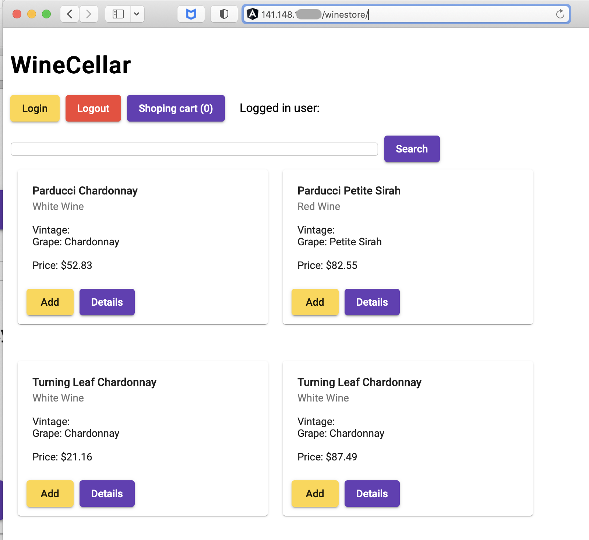

# Create a Kubernetes cluster

<details><summary><b>TODO</b></summary>

- By script (maybe something like `artifacts.mjs`); build and push Spring Boot app container image to OCI Container Registry (user and token has to be created with terraform). Add the image token secret to the kustomize deployment.
- Deploy **Spring Boot App** with MySQL connectivity
- Deploy a Checker (busybox) pod to run **cURL** commands to check the Spring Boot application.
- Store scripts and deployment code separately from markdown - include instructions to retrieve.
- Merge this **AUTOMATION** guide with the existing LiveLabs format.

</details>

## Introduction

This workshop uses Spring Boot-based Java microservices connecting to a MySQL HeatWave database as a target application to illustrate the capabilities for end-to-end monitoring using OCI Observability and Management Services. In this lab, you will utilize Terraform to provision your resources via Infrastructure as Code. This includes an Oracle Container Engine for Kubernetes (OKE) cluster, a MySQL DB System, and more. You will then enable HeatWave on the MySQL cluster, then deploy the application to your OKE cluster.

Estimated time: 25 minutes

### Objectives

* Create a compartment
* Provision resources with Terraform
* Activate MySQL HeatWave on the cluster

### Prerequisites

* This lab requires an [Oracle Cloud account](https://www.oracle.com/cloud/free/). You may use your cloud account, or a Free tier account, a cloud account that you obtained through a trial.


## Task 1: Create an OCI compartment

1. Open the navigation menu from the top-left corner (aka. hamburger menu) of the Oracle Cloud console and select **Identity & Security** > **Compartments**.
	
2. Click **Create Compartment**
	
3. Enter the following parameters:
*	Compartment name: **devlive24**
*	Description: **App Dev compartment for DevLive 2024**
*	Accept the default values for the other fields, and click, **Create Compartment**
	
*	Verify that your **devlive24** compartment is created in the table
	

## Task 2: Provision Infrastructure

1. Launch the OCI Cloud Shell.
   
2. Retrieve the sample code and supporting scripts that will be used in this section:

      ```bash
      <copy>
      get clone https://githubrepotobeadded
      </copy>
      ```
3. Change to the scripts folder and install dependancies. Then return to the root of the project folder.

      ```bash
      <copy>
      cd oci-appdev-devlive/scripts && npm install && cd ..
      </copy>
      ```
4. Set up the environment. It will create a `.env.json` file with all the information required. Do not alter or delete this file. Additionally, `.env.json` files are in the `.gitignore` file to ensure the contents never find their way to a public SCM site.

   As part of the script you will be prompted with a comparmtment name. Answer the **Compartment name** prompt with the name used in **Task 1**. The **`root`** compartment will be used if you do not enter a value.

      ```bash
      <copy>
      npx zx scripts/setenv.mjs
      </copy>
      ```

5. Next, run the script `tfvars.mjs` to create the `terraform.tfvars` file from the information generated by the previous step. It will use a template engine called Mustache to replace the values from `terraform.tfvars.mustache`.

      ```bash
      <copy>
      npx zx scripts/tfvars.mjs
      </copy>
      ```

6. The output of the `tfvars.mjs` script will tell you to run the following commands.

      ```bash
      <copy>
      cd deployment/terraform/
      terraform apply -auto-approve
      </copy>
      ```

> NOTE: terraform deployment will take ~34 minutes (mainly because the creation of the Kubernetes Cluster plus node pool, and the MySQL DB system with HeatWave cluster).

7. After a while, Terraform will finish and you can return to the root folder of the project.

      ```bash
      <copy>
      cd ../..
      </copy>
      ```


## Task 4: Add a HeatWave cluster to your MySQL HeatWave Database 

<details><summary><b>TODO</b></summary>

Update these instructions to reference creation of HeatWave cluster with existing DB System (provisioned by TF)

</details>

1.	From the OCI menu, select **Databases**, then **MySQL HeatWave > DB Systems**.
	

2. Select the **appdev** compartment from the pulldown menu and Click **Create DB System**
	

3.	Choose **Production** and select the **appdev** compartment and provide name **mysql-appdev**  for the MySQL HeatWave Database
  

4. Choose **Standalone**, enable **MySQL HeatWave** and provide MySQL HeatWave Database administration credentials.
  

5. Choose the VCN and private subnet of Oracle Kubernetes Cluster **k8-appdev** to allow access to MySQL HeatWave database from Kubernetes nodes and keep hardware settings default.  
  
  

6. Uncheck **Enable automatic backups** and in advanced settings under **Deletion Plan** Tab uncheck **Delete protected** and under  **Management** Tab check **Database Management**
  
  

7. This will start to create a MySQL HeatWave Database, and takes 10 to 12 minutes to complete. While waiting for the creation of the MySQL HeatWave Database, you can proceed to the next lab to create an virtual machine. In Lab 6, we will resume the steps to deploy the application connecting to the MySQL HeatWave Database.

  

## Task 4: Connect to Kubernetes and deploy the App

1. Export the `kubeconfig` variable to enable communication to your new OKE cluster. **Note**: During the Terraform execution process, the `kubeconfig` file was automatically retrieved and stored in a project subfolder. 

      ```bash
      <copy>
      export KUBECONFIG=~/oci-appdev-devlive/deployment/terraform/generated/kubeconfig
      </copy>
      ```

      > If the console closes, remember to rerun this command.
   
2. Check that Kubernetes is up and running and you can talk to the Control Plane API endpoint by listing the nodes.

      ```bash
      <copy>
      kubectl get nodes
      </copy>
      ```

3. Download the zip file to the Cloud Shell home directory.

      ```bash
      <copy>
      cd ~; wget https://objectstorage.us-phoenix-1.oraclecloud.com/n/axfo51x8x2ap/b/apmocw-bucket-2022/o/sb-hol.zip
      </copy>
      ```

4. Unzip the file. This will create a directory called **sb-hol**.

      ```bash
      <copy>
      unzip ~/sb-hol.zip
      </copy>
      ```

5. Change to the **sb-hol** directory and verify the deployment files.

      ```bash
      <copy>
      cd ~/sb-hol;ls
      </copy>
      ```

      >Note: Verify the follwoing files are present in the folder
      * apmlab-fss.yaml
      * wstore.yaml
      * wstore-add-storage.yaml
      * wstore-deploy-agent.yaml

6. Deploy the app to your OKE cluster.

      ```bash
      <copy>
      kubectl apply -f ~/sb-hol/wstore.yaml --validate=false
      </copy>
      ```

7. Run the `kubectl` command below to display the statue of the pod creation. Wait until all pods are in the 'Running' state. This might take a minute or two.

      ```bash
      <copy>
      kubectl get pods
      </copy>
      ```

8. Retrieve the public IP address for the application service endpoint. Copy it into a text file for future use.

      ```bash
      <copy>
      kubectl get svc
      </copy>
      ```

      

9. Refer to the example below and construct a URL, then paste it into the address bar of a new browser tab. If you see the WineCellar content as illustrated in the screenshot below, deployment was successfull.

      ```bash
      <copy>
      http://<IP of the wstore-frontend service>/winestore/
      </copy>
      ```

      

      >Note: It may take a few minutes to complete the deployment and start loading the page content on the screen for the first time.

You may now **proceed to the next lab**.

## Acknowledgements

* **Author** - Anand Prabhu, Principal Member of Technical Staff, Enterprise and Cloud Manageability
- **Contributors** -
Yutaka Takatsu, Senior Principal Product Manager,  
Avi Huber, Vice President, Product Management
* **Last Updated By/Date** - Anand Prabhu, January 2024