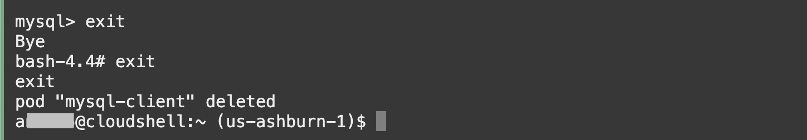

# Deploy the Application

## Introduction

Now that the infrastructure is up and running, it's time to deploy the app and see it all come together.

Estimated time: 10 minutes

### Objectives

* Connect to the OKE Cluster
* Prepare the MySQL Database
* Deploy the application

### Prerequisites

* Completion of the previous labs

## Task 1: Connect to Kubernetes

1. Export the `kubeconfig` variable to enable communication to your new OKE cluster. **Note**: During the Terraform execution process, the `kubeconfig` file was automatically retrieved and stored in a project subfolder. 

      ```bash
      <copy>
      export KUBECONFIG=~/oci-devlive-2024/deployment/terraform/generated/kubeconfig
      </copy>
      ```

      > If the console closes, remember to rerun this command.
   
2. Check that Kubernetes is up and running and you can talk to the Control Plane API endpoint by listing the nodes.

      ```bash
      <copy>
      kubectl get nodes
      </copy>
      ```

      ```bash
      $ kubectl get nodes
      NAME          STATUS   ROLES   AGE   VERSION
      10.0.156.59   Ready    node    3d    v1.28.2
      ```

## Task 2: Prepare Database for the application

1. Deploy an OKE Pod containing the MySQL client that will be used to connect to the DB System.

      ```bash
      <copy>
      kubectl run mysql-client --image=iad.ocir.io/axfo51x8x2ap/load-mysql-data:latest -it --rm --restart=Never -- /bin/bash
      </copy>
      ```

      

2. Execute the command below to connect to the MySQL HeatWave Database using the Private IP address of the database and the credentials provided when the DB System was created.

      ```bash
      <copy>
      mysql -h <mds-private-ip-address> -u <mds-admin-user> -p
      </copy>
      ```

      

3. Execute the command below to create a **`WINE`** application database with required tables.

      ```bash
      <copy>
      source insert_100_mysql.sql
      </copy>
      ```

      

4. Type **exit** to leave the MySQL client, then **exit** once more to leave and terminate the MySQL Client pod.

      


## Task 3: Deploy the application

1. Navigate to the app deployment folder.

      ```bash
      <copy>
      cd ~/oci-devlive-2024/sb-hol
      </copy>
      ```

2. Verify the contents of the **sb-hol** directory.

      ```bash
      <copy>
      ls
      </copy>
      ```

      >Note: Verify the follwoing files are present in the folder
      * apmlab-fss.yaml
      * Dockerfile
      * wstore.yaml
      * wstore-add-storage.yaml
      * wstore-deploy-agent.yaml

3. Deploy the app to your OKE cluster.

      ```bash
      <copy>
      kubectl apply -f ~/sb-hol/wstore.yaml --validate=false
      </copy>
      ```

### Task 3b: Test format

1. Run the `kubectl` command below to display the statue of the pod creation. Wait until all pods are in the 'Running' state. This might take a minute or two.

      ```bash
      <copy>
      kubectl get pods
      </copy>
      ```

      ```bash
      $ kubectl get pods
      NAME             READY   STATUS    RESTARTS   AGE
      wstore-back-0    1/1     Running   0          2d23h
      wstore-back-1    1/1     Running   0          2d23h
      wstore-front-0   1/1     Running   0          2d23h

8. Retrieve the public IP address for the application service endpoint. Copy it into a text file for future use.

      ```bash
      <copy>
      kubectl get svc
      </copy>
      ```

      

9. Refer to the example below and construct a URL, then paste it into the address bar of a new browser tab. If you see the WineCellar content as illustrated in the screenshot below, deployment was successfull.

      ```bash
      <copy>
      http://<IP of the wstore-frontend service>/winestore/
      </copy>
      ```

      

      >Note: It may take a few minutes to complete the deployment and start loading the page content on the screen for the first time.

You may now **proceed to the next lab**.

## Acknowledgements

* **Author** - Anand Prabhu, Principal Member of Technical Staff, Enterprise and Cloud Manageability
- **Contributors** -
Yutaka Takatsu, Senior Principal Product Manager,  
Avi Huber, Vice President, Product Management
* **Last Updated By/Date** - Anand Prabhu, January 2024