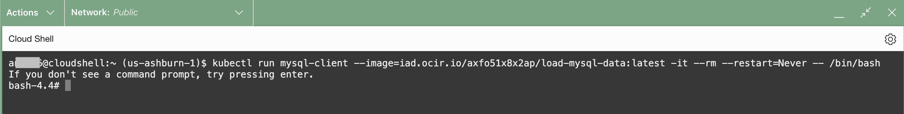
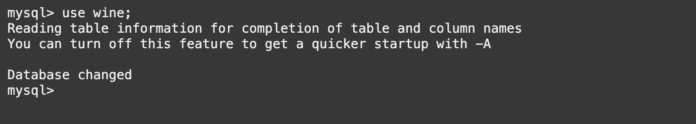
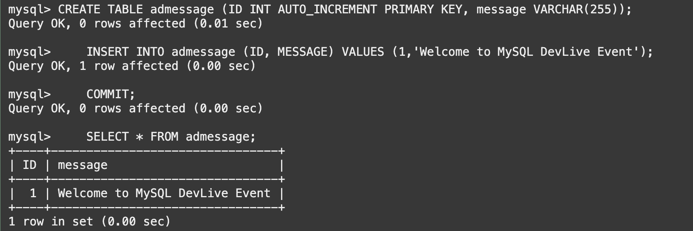
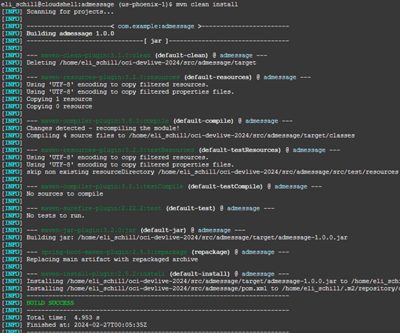
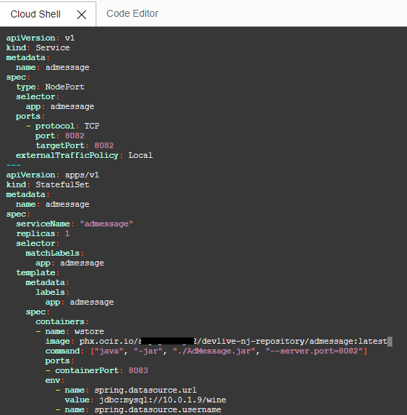
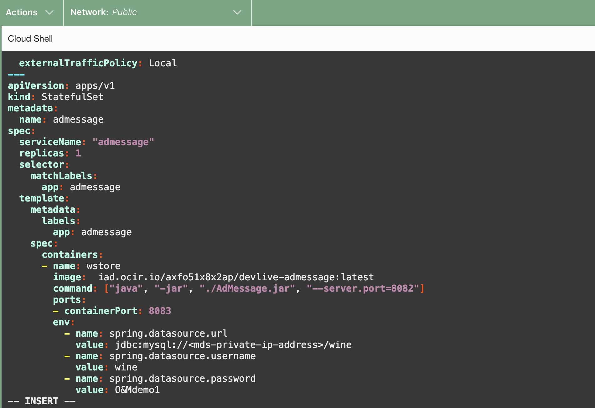
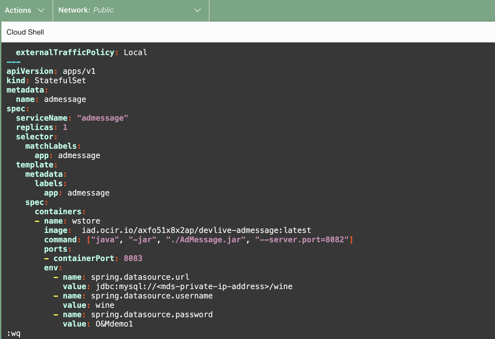
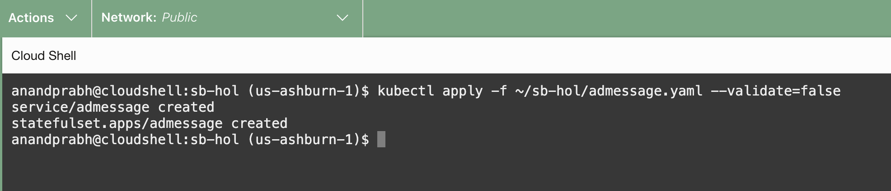

# Build a microservices application using Oracle AI Code Assist 

## Introduction

In this workshop you'll enhance the existing microservices application with a brand new component. Currently, we have a static ad message **2023 Thanks Giving Promotion: Buy 1 get 1!!!!** shown in the storefront. Watch as we use Oracle AI Code Assist to generate all the code for a Spring Boot-based Java app. That code has been provided as part of the workshop resources so now it's time to package and deploy it.

For this portion of the workshop, you have three different options to pick from:
1. [ ~20 minutes ] Build, package, and deploy the code entirely on your own.
2. [ ~10 minutes ] Run the pre-built script provided to automatically build and package the new app component. Then deploy to kubernetes.
3. [ ~5 minutes ] Deploy the new app component with the container image provided

Estimated time: Up to 20 minutes

### Objectives

* Update the MySQL HeatWave Database with a new table
* Choose how you want to deploy the new component


## Task 1 Create table **admessage** in the MySQL HeatWave Database

1. Deploy an OKE Pod containing the MySQL client that will be used to connect to the DB System.

      ```bash
      <copy>
      kubectl run mysql-client --image=iad.ocir.io/axfo51x8x2ap/load-mysql-data:latest -it --rm --restart=Never -- /bin/bash
      </copy>
      ```

      

2. Execute the command below to connect to the MySQL HeatWave Database using the Private IP address of the database and the credentials provided when the DB System was created.

      ```bash
      <copy>
      mysql -h <mds-private-ip-address> -u <mds-admin-user> -p
      </copy>
      ```

      

3. Execute the command below to connect to the **wine** database

    ```bash
    <copy>
    use wine;
    </copy>
    ```

    

4. Execute below sql statement to create the table **admessage**, then insert a new record

    ```bash
    <copy>
    CREATE TABLE admessage (ID INT AUTO_INCREMENT PRIMARY KEY, message VARCHAR(255));
    INSERT INTO admessage (ID, MESSAGE) VALUES (1,'Welcome to MySQL DevLive Event');
    COMMIT;
    SELECT * FROM admessage;
    </copy>
    ```

    


## Task 2 - Deployment Option 1: Full DIY Approach

The full do it yourself (DIY) approach involves building the app with the new code, using the output to create a new container image, pushing that image to the OCI Container Registry (OCIR), and deploying the app to Kubernetes. If you choose this path, you can then skip the remaining deployment options. This will take about 20 minutes.

1. Build an artifact from the source code.

    ```bash
    <copy>
    cd ~/oci-devlive-2024/src/admessage
    mvn clean install
    </copy>
    ```

    

2. Prepare the container image

    ```bash
    <copy>
    docker build -f Dockerfile -t admessage:latest .
    </copy>
    ```

    ```bash
    $ docker build -f Dockerfile -t admessage:latest .
    Sending build context to Docker daemon  85.02MB
    Step 1/5 : FROM openjdk:17-oracle
    ---> 5e28ba2b4cdb
    Step 2/5 : WORKDIR /spring
    ---> Using cache
    ---> 15a38db6ecb3
    Step 3/5 : COPY target/admessage-1.0.0.jar ./admessage.jar
    ---> 38102ba43ae6
    Step 4/5 : COPY src/main/resources/application.properties application.properties
    ---> 893058f7d71b
    Step 5/5 : ENTRYPOINT ["java","-jar","./admessage.jar","--spring.config.location=file:/spring/application.properties"]
    ---> Running in 2cc7d9c84d19
    Removing intermediate container 2cc7d9c84d19
    ---> 5640fc1e1362
    Successfully built 5640fc1e1362
    Successfully tagged admessage:latest
    ```

3. Retrieve the user credentials for connecting to the OCI Container Registry

    ```bash
    <copy>
    cd ~/oci-devlive-2024/deployment/terraform/
    terraform output -json
    </copy>
    ```

    ```bash
    {
        "deploy_id": {
            "sensitive": false,
            "type": "string",
            "value": "nj"
        },
        "repository_name": {
            "sensitive": false,
            "type": "string",
            "value": "devlive-nj-repository/admessage"
        },
        "user_auth_token": {
            "sensitive": true,
            "type": "string",
            "value": "z---redacted---t"
        },
        "user_email": {
            "sensitive": false,
            "type": "string",
            "value": "devlive-nj-ocir-user@example.com"
        },
        "user_name": {
            "sensitive": false,
            "type": "string",
            "value": "devlive-nj-ocir-user"
        }
    }
    ```

4. Copy the **value** for repository_name, user_auth_token, and user_name and store them for later use.

5. Retrieve the Object Storage Namespace for the tenancy and store it for later use.

    ```bash
    <copy>
    oci os ns get
    </copy>
    ```

    ```bash
    {
    "data": "a---redacted---2"
    }
    ```

6. Tag the container image

    ```bash
    <copy>
    docker tag admessage phx.ocir.io/{object storage namespace}/devlive-nj-repository/admessage.v1.0:latest
    </copy>
    ```

    >NOTE: `phx.ocir.io` is the endpoint for your selected region. If you are not using Phoenix, replace `phx` with the 3-letter abbreviation for your region.

    ```bash
    $ docker tag admessage phx.ocir.io/a---redacted---2/devlive-nj-repository/admessage.v1.0:latest
    ```

7. Authenticate to OCIR. This will require the `user_name` and `user_auth_token` values copied earlier.

    ```bash
    <copy>
    echo "<replace with auth token value>" | docker login -u <os namespace>/user_name --password-stdin phx.ocir.io
    </copy>
    ```

    >NOTE: Once again, be sure to replace `phx` with the abbreviation for your selected region.

    ```bash
    $ echo "---redacted---" | docker login -u a---redacted---2/devlive-nj-ocir-user --password-stdin phx.ocir.io

    Login Succeeded
    ```

8. Push the container image to OCIR

    ```bash
    <copy>
    docker push phx.ocir.io/a---redacted---2/devlive-nj-repository/admessage:latest
    <copy>
    ```

    ```bash
    $ docker push phx.ocir.io/a---redacted---2/devlive-nj-repository/admessage:latest
    The push refers to repository [phx.ocir.io/a---redacted---2/devlive-nj-repository/admessage]
    68c651c86e51: Pushed 
    9d8f57404a71: Pushed 
    0bf5a6521e69: Pushed 
    dc9fa3d8b576: Pushed 
    27ee19dc88f2: Pushed 
    c8dd97366670: Pushed 
    latest: digest: sha256:94570178a7149ca8dda2b921b2e04440d99cbb94d5d89a960fe31eb1898d8f6a size: 1579
    ```

9. Update the deployment YAML for the new AdMessage service

    ```bash
    <copy>
    cd ~/oci-devlive-2024/sb-hol
    vi admessage.yaml
    </copy>
    ```

    * Update the field for **image** (line 32). Use the full path from the previous `docker push` command.

    
    
    * Update the field for the MySQL HeatWave Databae Private IP (line 38)

    

    * Press the Esc key to ensure you are in command mode.
    * Type `:wq` (colon followed by wq) in the editor.
    * Press Enter to execute a save and exit.

    

10. Execute the command below to deploy the **AdMessage** application to the cluster.

    ```bash
    <copy>
    kubectl apply -f admessage.yaml --validate=false
    </copy>
    ```

    Verify the service and stateful set are both created:

    

11. Verify that the new **admessage** pod is running successfully

    ```bash
    <copy>
    kubectl get pods
    </copy>
    ```

    ```bash
    $ kubectl get pods
    NAME             READY   STATUS    RESTARTS   AGE
    admessage-0      1/1     Running   0          23m
    wstore-back-0    1/1     Running   0          110m
    wstore-back-1    1/1     Running   0          110m
    wstore-front-0   1/1     Running   0          5s
    ```

## Task 2 - Deployment Option 2: Take the automated path

1. Run the super awesome script (TODO: expand further)

    ```bash
    <copy>
    cd ~/oci-devlive-2024
    npx zx scripts/artifacts.mjs
    </copy>
    ```


## Task 2 - Deployment Option 3: Just Deploy

1. Navigate to the **sb-hol** directory and deploy with the existing resources provided


    ```bash
    <copy>
    cd ~/oci-devlive-2024/sb-hol
    kubectl apply -f admessage.yaml --validate=false
    </copy>
    ```

    Verify the new service and statefule set are created

    

## Task 3 - Integrate the AdMessage API with the main Wine App

1. Modify **wstore.yaml** and update the endpoint of the **AdMessage** service.

    ```bash
    <copy>
    cd ~/oci-devlive-2024/sb-hol
    vi wstoreyaml
    </copy>
    ```


You may now **proceed to the next lab**.

## Acknowledgements

* **Author** - Wojciech Pluta, Principal Staff Developer
- **Contributors** -
Victor Martin, Product Strategy Directory 
Eli Schilling, Developer Advocate
* **Last Updated By/Date** - Eli Schilling, February 2024